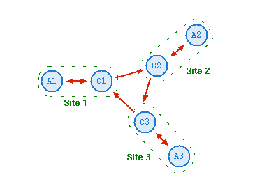

# LISEZ-MOI

## Explication du projet

## Logique du réseau 

**topologie en anneau unidirectionnel, où chaque contrôleur :**
- lit depuis son application locale (/tmp/out_Ax)
- écrit vers son application locale (/tmp/in_Ax)
- et redirige également ses messages vers le contrôleur suivant (/tmp/in_C(x+1))

_l'exemple du contrôleur 1 (C1) :_
- Il reçoit des messages de son app locale (app1) via /tmp/out_A1
- Il envoie ses messages à :
  - son app locale (/tmp/in_A1)
  - le contrôleur suivant, ici C2 via /tmp/in_C2

ça se traduit par : 
`cat /tmp/out_C1 | tee /tmp/in_A1 > /tmp/in_C2 &`
